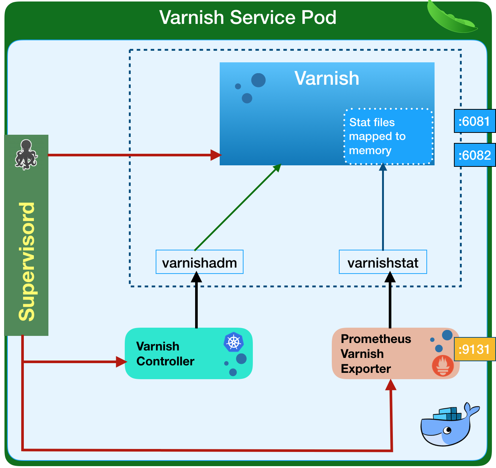

# Architecture

Varnish operator consists of multiple components working together to operate Varnish clusters.

#### CustomResourceDefinition
CustomResourceDefinition extends Kubernetes with the actual `VarnishService` resource that acts in the same way that a Service resource does, except with an added Varnish layer between the Service and the Deployment it backs. You would define a resource of Kind `VarnishService` and specify all the regular specs for a Service, plus some new fields that control how many Varnish instances you want, how much memory/cpu they get, and other relevant information for the Varnish cluster.

`VarnishService` spec fields are described in the [VarnishService configuration](varnish-service-configuration.md) section.

#### Varnish Operator
The Varnish operator is an application deployed into your cluster that knows how to react to the VarnishService CustomResource. Meaning, this application watches for new or changed `VarnishService`s and handles the actual underlying infrastructure. It must be running at all times in the cluster and it usually lives in its own namespace away from your application. It is built using the [Kubebuilder SDK](https://github.com/kubernetes-sigs/kubebuilder).

You can [configure](operator-configuration.md) the varnish operator via its Helm chart.

#### Varnish container image

The container image is custom built with a few components built-in - Varnish, Varnish-Controller, and the Prometheus metrics exporter. The operator doesn't support arbitrary Varnish images due to additional components needed for the operator to function.

##### Varnish

The Varnish process itself. Currently only Varnish version `6.1.1` is supported.

##### Varnish-Controller

Varnish-Controller is a process that runs along with every Varnish instance in the same container. It watches the resources needed to build the VCL configuration (ConfigMap with VCL files, backend pods, Varnish pods) and rebuilds it every time it notices a change.

##### Prometheus metrics exporter

The container also includes a [Prometheus metrics exporter](https://github.com/jonnenauha/prometheus_varnish_exporter) process for Varnish instances. The Service port it is listening on is configurable in the [VarnishService spec](varnish-service-configuration.md). 
