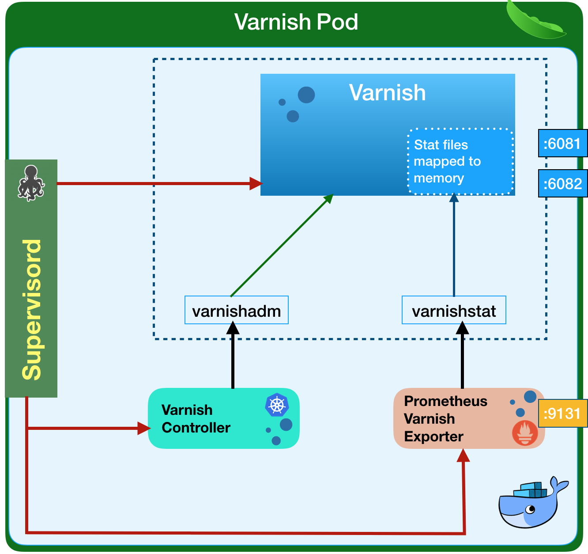

# Architecture

Varnish operator consists of multiple components working together to operate a Varnish clusters.

#### CustomResourceDefinition
CustomResourceDefinition extends Kubernetes with a `VarnishCluster` resource that describes your Varnish instances being deployed. You would define a resource of Kind `VarnishCluster` and specify all the relevant specs needed to define your the Varnish cluster (backends being cached, service port that exposes Varnish instances, VCL configuration, cpu/memory requests and limits, etc.). 

`VarnishCluster` spec fields are described in the [VarnishCluster configuration](varnish-cluster-configuration.md) section.

#### Varnish Operator
The Varnish Operator is an application deployed into your cluster that knows how to react to the `VarnishCluster` resource. Meaning, this application watches for new or changed `VarnishCluster`s and handles the actual underlying infrastructure. It must be running at all times in the cluster and it usually lives in its own namespace away from your application. It is built using the [Kubebuilder SDK](https://github.com/kubernetes-sigs/kubebuilder).

You can [configure](operator-configuration.md) the Varnish Operator via its Helm chart.

#### Varnish container image

The container image is custom built with a few components built-in - Varnish, Varnish-Controller, and the Prometheus metrics exporter. The operator doesn't support arbitrary Varnish images due to additional components needed for the operator to function.

##### Varnish

The Varnish process itself. Currently only Varnish version `6.1.1` is supported.

##### Varnish-Controller

Varnish-Controller is a process that runs along with every Varnish instance in the same container. It watches the resources needed to build the VCL configuration (ConfigMap with VCL files, backend pods, Varnish pods) and rebuilds it every time it notices a change.

##### Prometheus metrics exporter

The container also includes a [Prometheus metrics exporter](https://github.com/jonnenauha/prometheus_varnish_exporter) process for Varnish instances. The Service port it is listening on is configurable in the [VarnishCluster spec](varnish-cluster-configuration.md). 
