# VarnishCluster

### Creating a `VarnishCluster` Resource

Once you've [installed the operator](installation.md), you can create a new type of resource - `VarnishCluster`.

As with any other Kubernetes resource, simply `kubectl apply -f <varnish-cluster>.yaml` to create a `VarnishCluster`.

Here's an example of a simple `VarnishCluster`:

```yaml
apiVersion: caching.ibm.com/v1alpha1
kind: VarnishCluster
metadata:
  labels:
    operator: varnish
  name: varnish-cluster-example
spec:
  vcl:
    configMapName: vcl-config
    entrypointFileName: entrypoint.vcl
  backend:
    selector:
      app: nginx
  service:
    port: 8080
``` 
 
Once the `VarnishCluster` is created, you should see:

* a StatefulSet with the name `<varnish-cluster-name>`.
* 2 services, one `<varnish-cluster-name>` and one `<varnish-cluster-name>-no-cache`. As is implied by the names, using `<varnish-cluster-name>` will target the Varnish pods, while `<varnish-cluster-name>-no-cache` will target the underlying pods directly, with no Varnish caching.
* A ConfigMap with VCL in it (either user-created, before running `kubectl apply -f <varnish-cluster>.yaml`, or generated by operator)
* A role/rolebinding/clusterrole/clusterrolebinding/serviceAccount combination to give the Varnish pods the ability to access necessary resources.
* If configured, a PodDisruptionBudget

See [VarnishCluster configuration section](varnish-cluster-configuration.md) for all available fields for configuration.

### VarnishCluster Status

The VarnishCluster keeps track of its current status as events occur in the system. This can be seen through the `Status` field, visible from `kubectl describe vc <your-varnishcluster>`.

### Labels

The labels set for `VarnishCluster` are inherited by all dependent components (Service, StatefulSet, etc.).

Besides custom labels, the operator sets its own:

 * `varnish-owner` - name of the VarnishCluster a particular component belongs to
 * `varnish-component` - name of the component

The `varnish-component` could have the following values:

 * `varnish` - Varnish pod
 * `cache-service` - Kubernetes Service exposing Varnish instances
 * `nocache-service` - Kubernetes Service exposing backends bypassing Varnish
 * `clusterrole` - The clusterrole defining the cluster level permissions for a particular `VarnishCluster`
 * `clusterrolebinding` - Binds the clusterrole to the serviceaccount used by a particular `VarnishCluster`
 * `role` - The role defining the namespaced permissions for a particular `VarnishCluster`
 * `rolebinding` - Binds the role to the serviceaccount used by a particular `VarnishCluster`
 * `vcl-file-configmap` - The ConfigMap that stores the VCL files
 * `secret` - The Secret to keep `varnishadm` auth credentials
 * `headless-service` - A headless service that backs the StatefulSet
 * `poddisruptionbudget` - PodDisruptionBudget configuration for a particular `VarnishCluster`
 * `serviceaccount` - A serviceaccount used by the Varnish pods

### Updating a VarnishCluster Resource

Just as with any other Kubernetes resource, using `kubectl apply`, `kubectl patch`, or `kubectl replace` will all update the `VarnishCluster` appropriately. The operator will handle how that update propagates to its dependent resources. Conversely, trying to modify any of those dependent resources (StatefulSet, Services, Roles/Rolebindings, etc) will cause the operator to revert those changes, in the same way a Deployment does for its Pods. The only exception to this is the ConfigMap, the contents of which you [can and should modify](vcl-configuration.md), since that is the VCL used to run the Varnish Pods.

Some spec changes (like the image version or container config change) need a pod restart in order to be applied. As Varnish is an in-memory cache, it means cache data loss. To prevent accidental cache loss, by default, the update strategy is `OnDelete` which means the pods won't automatically get restarted. To update the pod you need to delete the pod manually, and it will come back with the new configuration. This behavior can be changed by setting the desired update strategy in the `.spec.updateStrategy` object. See [VarnishCluster Configuration](varnish-cluster-configuration.md) section for more details.

#### DelayedRollingUpdate

Besides standard update strategies like `OnDelete` and `RollingUpdate`, the Varnish Operator has an another one - `DelayedRollingUpdate`.

`DelayedRollingUpdate` works the same way as `RollingUpdate` with the difference being a pause between pod updates. This is useful when all you want is to wait for a recently updated Varnish node to warm up before an another one reloads. The delay is configurable by the `.spec.updateStrategy.delayedRollingUpdate.delaySeconds` field. 

The delay is counted from the time the pod is created in Kubernetes, not when it got scheduled and become ready so this has to be considered when choosing the delay time.

The operator respects Pods readiness and does not reload the next pod until all pods are ready, even if the delay time elapsed. 

#### Forcefully restarting Varnish pods

Sometimes it is necessary to purge the cluster cache. For example, when a backend with a bug produced a bad response that got cached. After the fix is deployed, we need to purge the cache. This can be achieved by simply restarting the pods. 

If you need to control when the next pod should restart, you can simply delete pods one by one as necessary. A new pod will come up right after deletion (standard statefulset behavior).

For more automated solution use `kubectl rollout restart statefulset <sts-name>` on the statefulset running your Varnish pods. It will recreate the pods with the current configuration using the configured update strategy. Keep in mind that if you use `OnDelete` update strategy, it doesn't make sense to use this approach as you still have to manually delete the pods to complete the update. Use it with `RollingUpdate` and `DelayedRollingUpdate` update strategies.

### Deleting a VarnishCluster Resource

Simply calling `kubectl delete` on the `VarnishCluster` will recursively delete all dependent resources, so that is the only action you need to take. This includes a user-generated ConfigMap, as the VarnishCluster will take ownership of that ConfigMap after creation. Deleting any of the dependent resources will trigger the operator to recreate that resource, in the same way that deleting the Pod of a Deployment will trigger the recreation of that Pod.

### Accessing the management interface

In case you have the need to control varnish through the management interface, it is available at port `6082`.

From your application you can connect to the Varnish pod using its DNS name: `<pod-name>.<varnishcluster-name>-headless-service.<namespace>.svc.cluster.local:6082`.
For example, if your `VarnishCluster` is named `example`, you can connect to the first pod with the following command:

```bash
$ varnishadm -T example-varnish-0.example-headless-service.default.svc.cluster.local:6082 -S /etc/varnish-secret/secret
200
-----------------------------
Varnish Cache CLI 1.0
-----------------------------
Linux,5.8.0-45-generic,x86_64,-jnone,-sdefault,-sdefault,-hcritbit
varnish-6.1.1 revision efc2f6c1536cf2272e471f5cff5f145239b19460

Type 'help' for command list.
Type 'quit' to close CLI session.

varnish>
```

You will need to specify the authentication secret file. It can be found in the `<varnishcluster-name>-varnish-secret` secret by default which can be mounted into your pod.

### Topology-aware load balancing

The Varnish controller is capable of discovering the cluster's geographical topology by reading its node labels, specifically `topology.kubernetes.io/zone` (or `failure-domain.beta.kubernetes.io/zone` which deprecated but still may be in use). Knowing cluster topology empowers the operator to control how traffic to the application backends is distributed. Currently the topology information is used to change an application backend's priority by changing its weight, so **local** backends (located in the same zone as Varnish pod) can be preferred over **remote** backends (located in other zones related to Varnish pod location). Such a configuration may not only reduce cross-zone traffic and therefore its cost, but potentially can reduce Varnish to backend latency. However, this functionality have some limitations. At this moment, only the Random Director can accept weight as backend parameter.

There are currently two zone balancing types available: `auto` and `thresholds`. Both are optional and can be configured in the `backend` section of [`VarnishCluster`](varnish-cluster-configuration.md) custom resource.

Before configuring any of available zone-balancing methods, it crucial to understand how the Random Director calculates traffic flow based on backend weight. Each backend will receive approximately `100 * (weight / (sum(all_added_weights)))` percent of the traffic sent to the director. So given scenario with three backends having different weights:

```vcl
new real = directors.random();
real.add_backend(backend1, 5.0);
real.add_backend(backend2, 5.0);
real.add_backend(backend3, 10.0);
```
The following demonstrates the formula's usage to calculate the traffic percentage to each backend:
```
backend1: 100 * (5 / (5 + 5 + 10)) = 25%
backend2: 100 * (5 / (5 + 5 + 10)) = 25%
backend3: 100 * (10 / (5 + 5 + 10)) = 50%
```
As seen from this example, not only raw backend weight affects traffic distribution, but also total number of backends and their weights.

Following multi-zone cluster will be used in examples as the reference, however it is too busy when full traffic path is pictured. So some parts like external LB and Ingress will be omitted for clarity.

<!-- [](https://mermaid-js.github.io/mermaid-live-editor/#/edit/eyJjb2RlIjoiZ3JhcGggVEJcbiAgICBsYltMQl0gLS0-fFJSfCBpbjAgJiBpbjEgJiBpbjJcbiAgICBpbjBbaW5ncmVzc10gLS0-fFJSfCB2MCAmIHYxICYgdjJcbiAgICBpbjFbaW5ncmVzc10gLS0-fFJSfCB2MSAmIHYwICYgdjJcbiAgICBpbjJbaW5ncmVzc10gLS0-fFJSfCB2MiAmIHYxICYgdjBcbiAgICB2MCAmIHYxICYgdjIgLS0-IGIwICYgYjEgJiBiMiAmIGIzICYgYjQgJiBiNSAmIGI2ICYgYjcgJiBiOFxuICAgIHN1YmdyYXBoIHpvbmUxXG4gICAgICAgIGluMFtpbmdyZXNzXVxuICAgICAgICB2MFt2YXJuaXNoLTBdXG4gICAgICAgIGIwXG4gICAgICAgIGIxXG4gICAgICAgIGIyXG4gICAgZW5kXG4gICAgc3ViZ3JhcGggem9uZTJcbiAgICAgICAgaW4xW2luZ3Jlc3NdXG4gICAgICAgIHYxW3Zhcm5pc2gtMV1cbiAgICAgICAgYjNcbiAgICAgICAgYjRcbiAgICAgICAgYjVcbiAgICBlbmRcbiAgICBzdWJncmFwaCB6b25lM1xuICAgICAgICBpbjJbaW5ncmVzc11cbiAgICAgICAgdjJbdmFybmlzaC0yXVxuICAgICAgICBiNlxuICAgICAgICBiN1xuICAgICAgICBiOFxuICAgIGVuZCIsIm1lcm1haWQiOnsidGhlbWUiOiJkZWZhdWx0In19) -->


#### Automatic mode

To enable `auto` zone balancing type it should be defined as `backend.zoneBalancing.type: auto` in the `VarnishCluster` CustomResource as follows:
```
  backend:
    selector:
      app: varnish-backend
    port: 8081
    zoneBalancing:
      type: auto
```
It doesn't requires any additional configuration. 

The main focus of automatic zone balancing mode is to keep most of the traffic passed through Varnish instance in the same zone. To achieve that, the Varnish controller will assign higher weights for the backends located in same zone as the Varnish pod. To figure out the backend location, the Varnish controller iterates through the list of available backends and finds where the pods are running by reading in the node topology labels. This allows the backends to be classified as `local` or `remote`.

When the topology is discovered, the Varnish controller will apply weight to the backends. Under normal conditions, `local` backends will get a weight of `10`, while `remote` will have `1`.

Following diagram displays simple scenario with 2 Varnish pods and 4 backends equally distributed across two zones:

<!-- [](https://mermaid-js.github.io/mermaid-live-editor/#/edit/eyJjb2RlIjoiZ3JhcGggVEJcbiAgICB2MCAtLT58MTB8IGIwICYgYjFcbiAgICB2MCAtLT58MXwgYjIgJiBiM1xuICAgIHYxIC0tPnwxMHwgYjIgJiBiM1xuICAgIHYxIC0tPnwxfCBiMCAmIGIxXG4gICAgc3ViZ3JhcGggem9uZTFcbiAgICB2MFt2YXJuaXNoLTBdXG4gICAgYjBcbiAgICBiMVxuICAgIGVuZFxuICAgIHN1YmdyYXBoIHpvbmUyXG4gICAgdjFbdmFybmlzaC0xXVxuICAgIGIyXG4gICAgYjNcbiAgICBlbmQiLCJtZXJtYWlkIjp7InRoZW1lIjoiZGVmYXVsdCJ9LCJ1cGRhdGVFZGl0b3IiOmZhbHNlfQ) -->


Having very polar weight might be not the best option when zone becomes degraded. Routing too much traffic to decreased amount of available backends can create a *hotspot* and even DoS. To prevent such scenario, `auto` balancing will calculate the ratio of backend count to average backend count in other zones and reduce the weight by that ratio.

Next diagram shows the same small topology as before, but now `zone1` lost one of the backends:

<!-- [](https://mermaid-js.github.io/mermaid-live-editor/#/edit/eyJjb2RlIjoiZ3JhcGggVEJcbiAgICB2MCAtLT58MTB8IGIwXG4gICAgdjAgLS0-fDF8IGIyICYgYjNcbiAgICB2MSAtLT58MTB8IGIyICYgYjNcbiAgICB2MSAtLT58MXwgYjBcbiAgICBzdWJncmFwaCB6b25lMVxuICAgIHYwW3Zhcm5pc2gtMF1cbiAgICBiMFxuICAgIGVuZFxuICAgIHN1YmdyYXBoIHpvbmUyXG4gICAgdjFbdmFybmlzaC0xXVxuICAgIGIyXG4gICAgYjNcbiAgICBlbmQiLCJtZXJtYWlkIjp7InRoZW1lIjoiZGVmYXVsdCJ9LCJ1cGRhdGVFZGl0b3IiOmZhbHNlfQ) -->


To eliminate a potential *hotspot* in `zone1`, the Varnish controller will change the local backend weight by `local_backends_count / (sum(remote_backends_count) / zone_count))`, so `1 / ( 2 / 1 ) = 0.5`. Which yields a `local` backend weight of `5`. With the same calculation applied to the healthy zone's backend weights, `local` backends in that zone will be changed by ratio `2 / ( 1 / 1 ) = 2` ending with weight of `20:`

<!-- [](https://mermaid-js.github.io/mermaid-live-editor/#/edit/eyJjb2RlIjoiZ3JhcGggVEJcbiAgICB2MCAtLT58NXwgYjBcbiAgICB2MCAtLT58MXwgYjIgJiBiM1xuICAgIHYxIC0tPnwyMHwgYjIgJiBiM1xuICAgIHYxIC0tPnwxfCBiMFxuICAgIHN1YmdyYXBoIHpvbmUxXG4gICAgdjBbdmFybmlzaC0wXVxuICAgIGIwXG4gICAgZW5kXG4gICAgc3ViZ3JhcGggem9uZTJcbiAgICB2MVt2YXJuaXNoLTFdXG4gICAgYjJcbiAgICBiM1xuICAgIGVuZCIsIm1lcm1haWQiOnsidGhlbWUiOiJkZWZhdWx0In0sInVwZGF0ZUVkaXRvciI6ZmFsc2V9) -->


All weight calculations are performed *in flight* and react to topology changes immediately as they occur.

#### Manual mode with pre-defined thresholds

Another zone-balancing method is `thresholds`, it gives all control of backend weights to user. To enable this balancing method, `backend.zoneBalancing.type` should be set to `thresholds`. It is also required to provide a set of thresholds and respective weights for local and remote backends.
```
  backend:
    selector:
      app: varnish-backend
    port: 8081
    zoneBalancing:
      type: thresholds
      thresholds: 
      - threshold: 100
        local: 10
        remote: 1
      - threshold: 50
        local: 1
        remote: 1
```
In the context of zone balancing, `threshold` is the percent representation of local backend count compared to average remote backend count per remote zone. Weight values defined for the threshold will be used when backend ratio is lower or equal given threshold, until next threshold condition is met. This way, if only one threshold is defined, weight values defined with it will be always applied to backends -- ignoring topology changes. This behavior allows to configure static weights for the backends.

It is important to always specify the best case scenario as well as worst case scenario (filling in intermediate threshold values is optional and gives more flexibility for topology routing). Otherwise, the *highest* threshold will be treated as the best case scenario until lower threshold from the list is passed. Usually, the `100` threshold will be always defined. This provides weight values that will be used when cluster operates under normal conditions and when backends are equally distributed across zones. 

The provided example below configures Varnish to prioritize local backends over remote backends under normal conditions by setting the local backends' weight to `10`, while remote backends will have the weight of `1`, (`100 * (2 / (2 / 1) = 100`):

<!-- [](https://mermaid-js.github.io/mermaid-live-editor/#/edit/eyJjb2RlIjoiZ3JhcGggVEJcbiAgICB2MCAtLT58MTB8IGIwICYgYjFcbiAgICB2MCAtLT58MXwgYjIgJiBiM1xuICAgIHYxIC0tPnwxMHwgYjIgJiBiM1xuICAgIHYxIC0tPnwxfCBiMCAmIGIxXG4gICAgc3ViZ3JhcGggem9uZTFcbiAgICB2MFt2YXJuaXNoLTBdXG4gICAgYjBcbiAgICBiMVxuICAgIGVuZFxuICAgIHN1YmdyYXBoIHpvbmUyXG4gICAgdjFbdmFybmlzaC0xXVxuICAgIGIyXG4gICAgYjNcbiAgICBlbmQiLCJtZXJtYWlkIjp7InRoZW1lIjoiZGVmYXVsdCJ9LCJ1cGRhdGVFZGl0b3IiOmZhbHNlfQ) -->


Next condition, `50` will be met when number of local backends as compared to remote will be `50` percent or less. In that case, varnish will be configured to set equal weight for all available backends to `1`, equalizing traffic flow (`100 * (1 / (2 / 1) = 50`):

<!-- [](https://mermaid-js.github.io/mermaid-live-editor/#/edit/eyJjb2RlIjoiZ3JhcGggVEJcbiAgICB2MCAtLT58MXwgYjBcbiAgICB2MCAtLT58MXwgYjIgJiBiM1xuICAgIHYxIC0tPnwxMHwgYjIgJiBiM1xuICAgIHYxIC0tPnwxfCBiMFxuICAgIHN1YmdyYXBoIHpvbmUxXG4gICAgdjBbdmFybmlzaC0wXVxuICAgIGIwXG4gICAgZW5kXG4gICAgc3ViZ3JhcGggem9uZTJcbiAgICB2MVt2YXJuaXNoLTFdXG4gICAgYjJcbiAgICBiM1xuICAgIGVuZCIsIm1lcm1haWQiOnsidGhlbWUiOiJkZWZhdWx0In0sInVwZGF0ZUVkaXRvciI6ZmFsc2V9) -->


